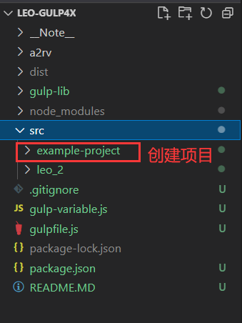
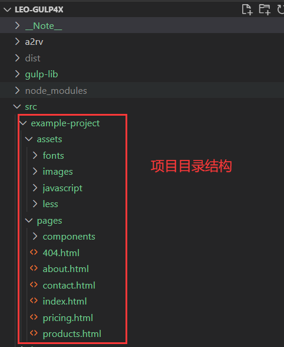
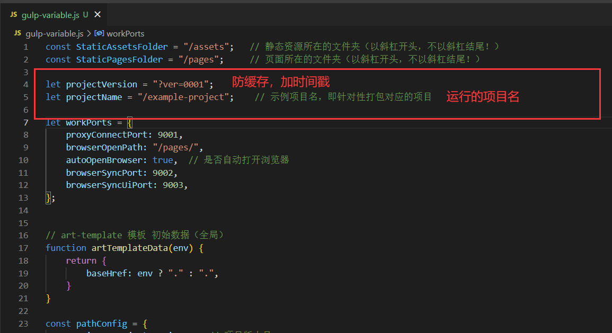
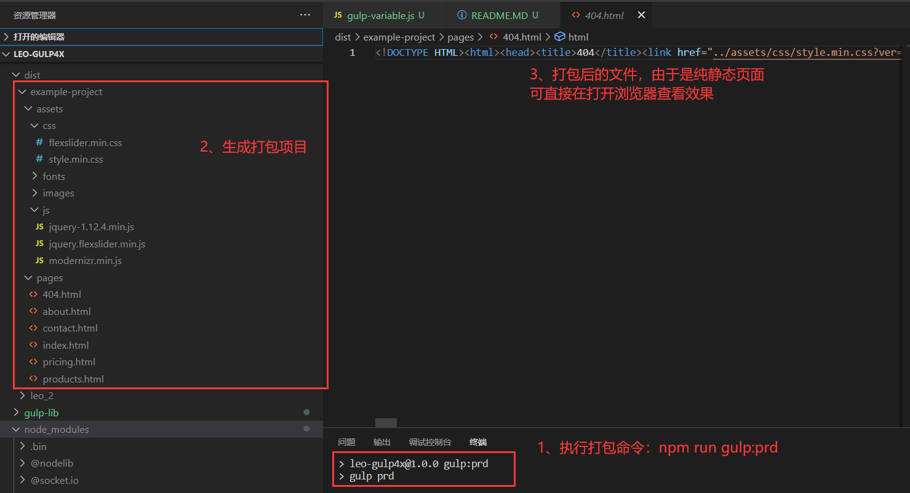

# leo-gulp4x
使用 Gulp 4.x 版本构建静态资源项目

## 1、在 src 目录下创建项目文件夹（如：example-project ）
<!--  -->
## 2、在 example-project 项目下分别创建 assets 和 pages 两个子目录。结构如下：
    example-project
        assets
            fonts               ：字体文件
            images              ：存放图片
            javascript          ：存放 JS 脚本
            less 或者 stylus    ：css 预编译语言（less 或 stylus，取决于用户习惯）
        pages
            components          ：存放公共模板
            index.html          ：入口文件（html）

<!--  -->

## 3、配置运行项目

在 gulp-variable.js 文件中修改变量 projectName ，将其改成要运行的项目（如：let projectName = "/example-project"）

    let projectName = "/example-project"

<!--  -->

## 4、运行项目

    npm install
    npm run gulp
    

## 5、打包

    npm run gulp:prd

<!--  -->

  

## 6、如果需要防止打包后出现静态资源缓存，在步骤4打包前修改 gulp-variable.js 文件的 projectVersion 值（随机生成即可）。如：

    let projectVersion = "/?ver=0010"

  

<!--  -->

  
  

## 备注：

该框架的不足：当项目页面过多时（pageNum > 100），建议选择性对子目录进行监听，避免监听整个pages目录（1、服务重启慢，2、服务内存容易溢出崩溃）

  

该项目不存在多层目录生成问题
assets 和 pages 目录下可以嵌套多个子目录
